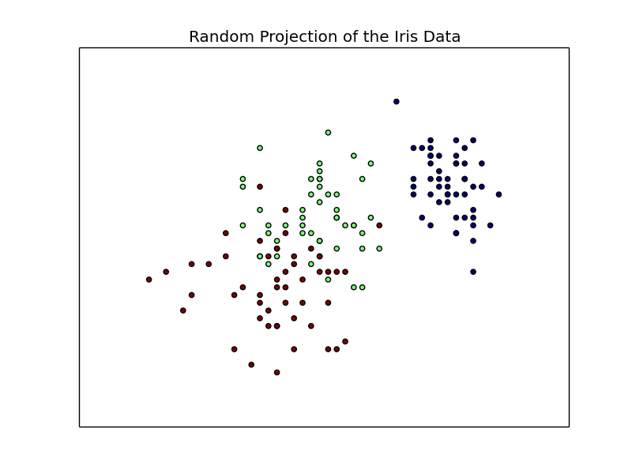
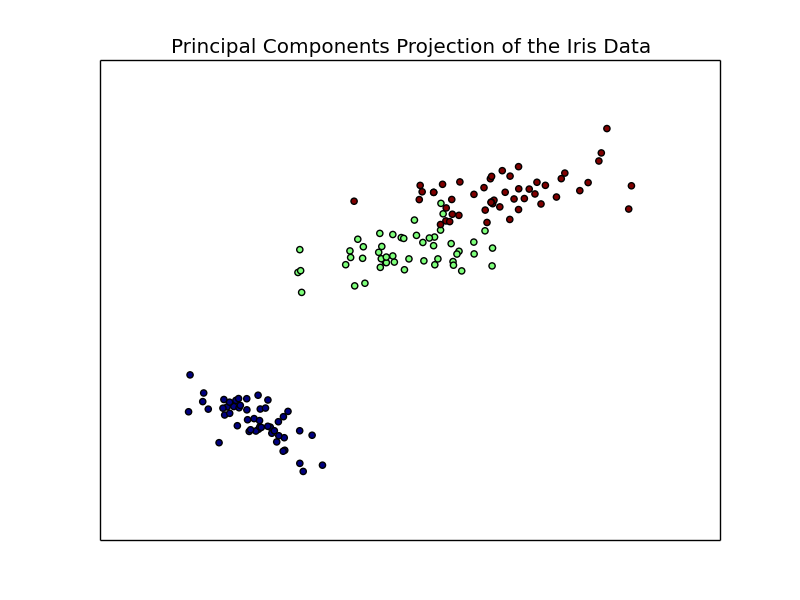
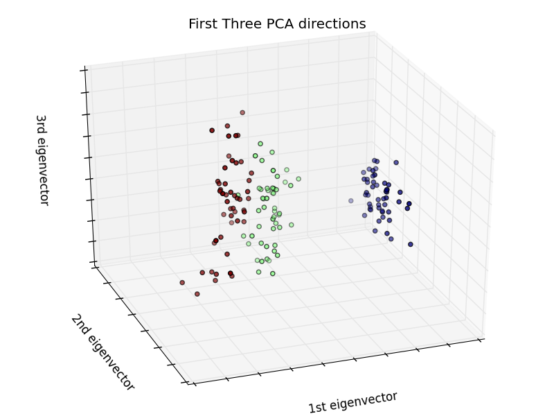

# Manifold Learning &amp; Dimensionality Reduction

A comparison of various manifold learning and dimensionality reduction techniques on the iris dataset. This analysis was created as part of an assignment submission for the course COMP 4190 - Artificial Intelligence.

## Data

I have chosen to work with the iris dataset, first used by Sir Ronald Fisher in a 1936 paper on discriminant analysis. This dataset has since been frequently used in pattern recognition literature and numerous academic papers. The data was acquired from the UCI Machine Learning Repository [here](http://archive.ics.uci.edu/ml/datasets/Iris).

The dataset contains 3 classes of 50 instances each, where each class corresponds to a specific type of iris plant. For each instance, 4 feature attributes are recorded: sepal length, sepal width, petal length, and petal width (all centimetres). The class of Iris-Setosa plants are linearly separable from the other 2 classes; however, the Iris-Versicolour and Iris-Virginica classes are not linearly separable.
 
## Analysis

I begin by taking a random 2D projection of the dataset, as a sort of "control" group for further dimensionality reduction. Even in this random 2D projection, we can already see that one cluster (upper right corner) is somewhat distinguishable from the rest of the data. Through the manifold learning techniques to follow, it will be my goal to further separate and distinguish the other 2 classes. 

### Principal Component Analysis (PCA)

Using a projection of the first 2 principal components, we see that there is a good degree of separation between the Iris-Setosa (blue) and the other 2 classes. Even the other 2 classes have separated quite well and made it easier to distinguish between plant type.

A projection of the first 3 principal components also shows good separtaion of the 3 classes. Overall, these PCA techniques, even in 2 directions, perform quite well.
